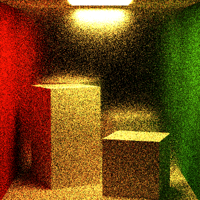
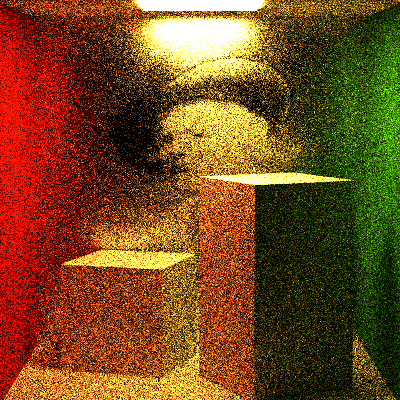
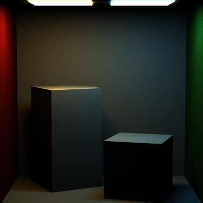
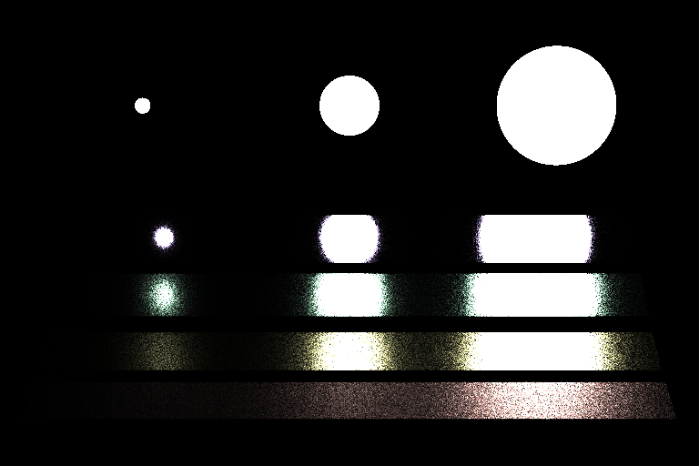

# CIS_461_HW6

## Reflection (MicroFacet Uniform) ##

## Reflection (MicroFacet Map) ##

## Transmit Materials (BTDF) ##

All right, after all kinds of bugs, I got it done. 

Besides, the GUI window is still rect, so for veach(which is wider), you may need to drag that window, manually.

